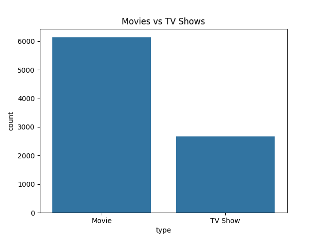
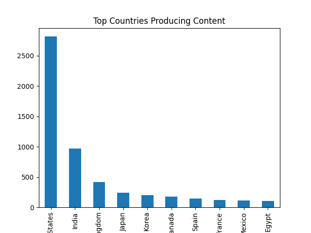
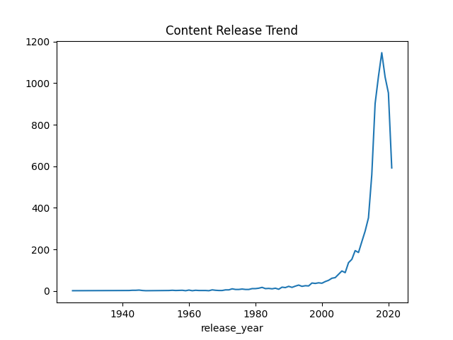

# Netflix Data Analysis

## Project Overview

This project analyzes Netflix dataset to find trends.

## Tools Used

- Python
- Pandas
- Matplotlib
- Seaborn

## Key Insights

- Movies dominate content
- USA produces most content
- Content increased after 2015
- ##  Visualizations

### Movies vs TV Shows

### Top Countries

### Release Trend

